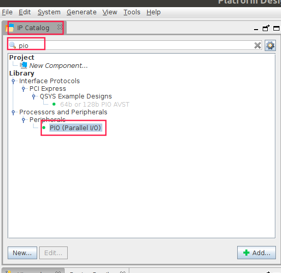
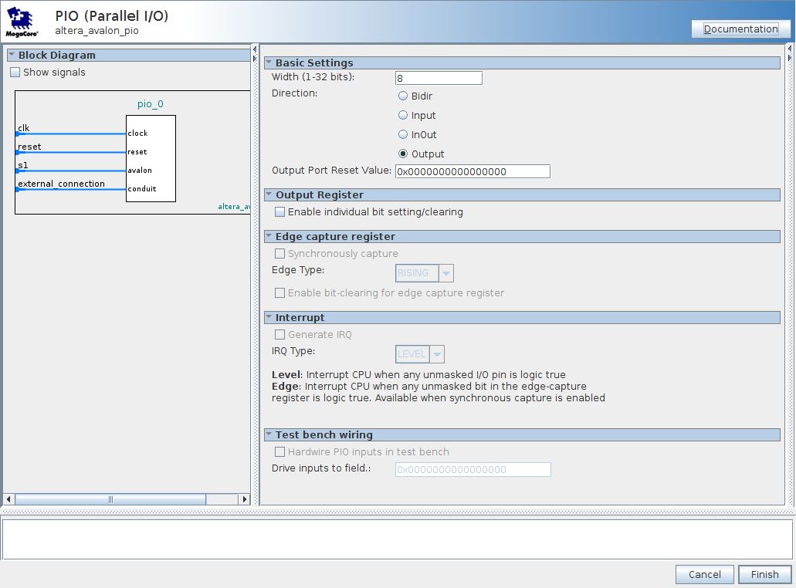
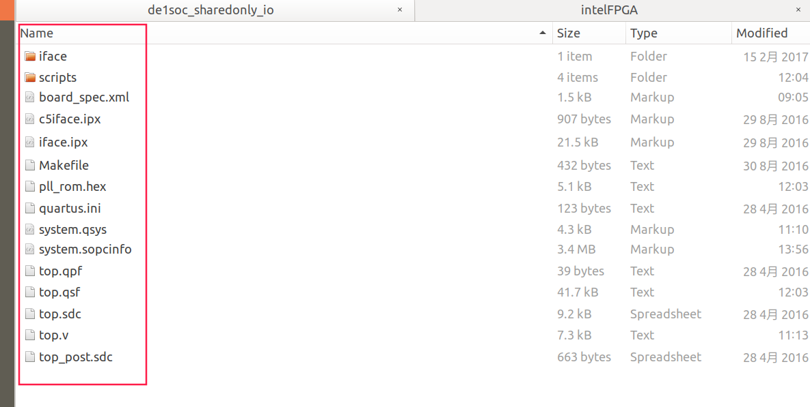
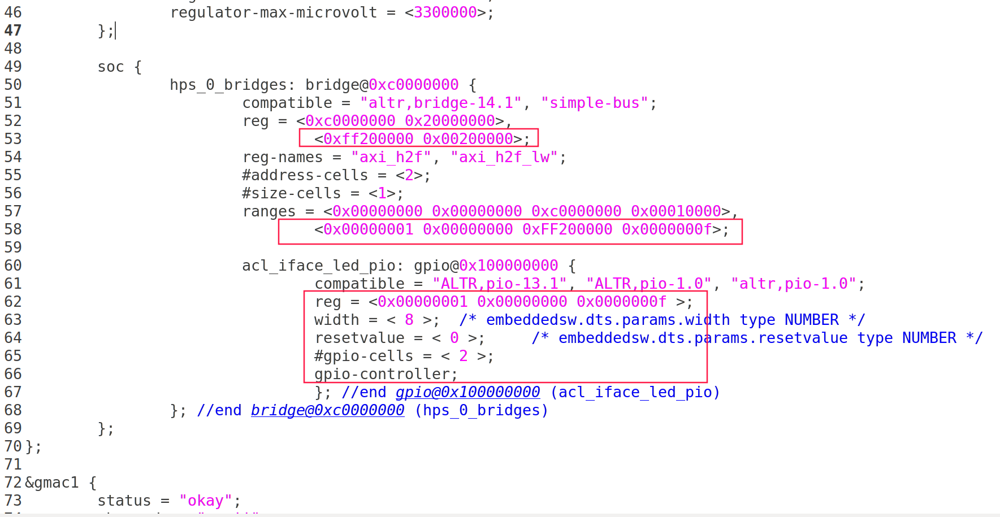

# How to Build Your Own BSP
## Build Hardware Template
1. Get the de1soc_sharedonly hardware tamplate for terasic's BSP. Rename it to `de1soc_sharedonly_io`

	

2. Modify the name to `de1soc_sharedonly_io` in board_spec.xml file 

	

3. File ->Open project in Quartus,browse to top.qpf file and  ->open

4. Tools->Qsys, open the system.qsys file

5. Double click the “acl_iface [acl_iface_system.qsys]” in Hierarchy Table

	

6. Search the PIO in the IP catalog table, and double click the PIO component

	

7. Set the parameter of PIO.With,Direction,bit-operate,interrupt and Edge capture. For output only,

	

8. Rename `pio_0` to `led_pio`, and connect the `led_pio` to `pipe_stage_host_ctrl`.
clk and reset are the same as pipe_stage_host_ctrl, led_pio's `s1` connect to pipe_stage_host_ctrl's `m0`.double click the `Double-click-to` of led_pio in `Export` to export the external_connection Port. And set an  valid address. 
Save without generating HDL

	

9. Double click the `system [system.qsys]` in Hierarchy Table , Then doube click the led_pio's Export to export the `acl_iface_led_pio_external_connection` and `Generate HDL`

	

10. Get the port description in file  `de1soc_sharedonly_io/system/system_inst.v`, and add it to `the_system` in top.v

	.acl_iface_led_pio_external_connection_export (<connected-to-acl_iface_led_pio_external_connection_export>)

	

11. Add `ledr` and `hex0` output in top.v and connect to led_pio port. Remove the `fpga_led_output` pins.

	

	

12. Remove `fpga_led_output` and add the `ledr` and `hex0` set_location in top.qsf	

	

13. Delete `acl_iface_partition.qxp` and other useless files.Finally,keep these files .

	

## Run Software
1. Git clone the linux-socfpga

	git clone https://github.com/thinkoco/linux-socfpga.git
	cd linux-socfpga
	git checkout -b socfpga-opencl_3.18 origin/socfpga-3.18

2. Modify the device tree source file(linux-socfpga/arch/arm/boot/dts/socfpga_cyclone5_de1soc_x2go.dts),update socfpga.dtb

	

	make socfpga_cyclone5_de1soc_x2go.dtb

3. Build opencl kernel

	aoc device/camera_sobel.cl -o bin/camera_sobel.aocx --board de1soc_sharedonly_io -v --report

4. Generate hps_0.h

	sopc-create-header-files ./system.sopcinfo --single hps_0.h --module acl_iface_hps

5. code in de1soc_sw_io, and build it on PC

6. aocl program and run host

	aocl program /dev/acl0  cemera_sobel.aocx
	./led_pio

