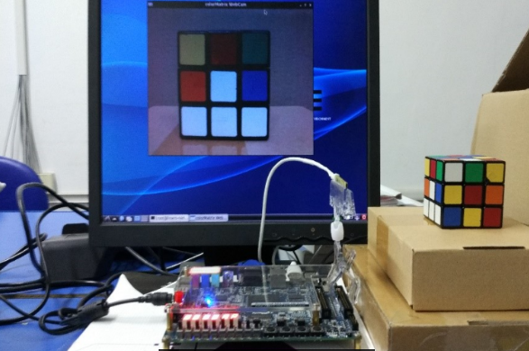
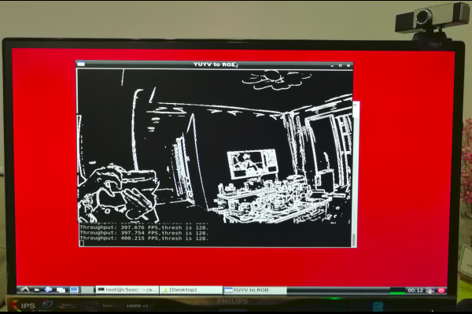
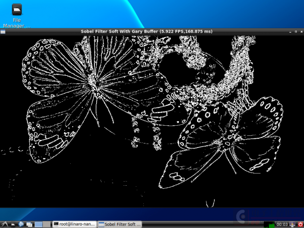

# IntelFPGA Cyclone V SoC OpenCL

##  Hardware Architecture

## Supported Boards

- [x] [DE1-SoC](http://www.terasic.com.cn/cgi-bin/page/archive.pl?Language=China&CategoryNo=182&No=870)
- [x] [DE10-Nano](http://www.terasic.com.cn/cgi-bin/page/archive.pl?Language=China&CategoryNo=203&No=1048)
- [x] [DE10-Standard](http://www.terasic.com.cn/cgi-bin/page/archive.pl?Language=China&CategoryNo=182&No=1105)
- [x] [DE10-Nano](http://www.terasic.com.cn/cgi-bin/page/archive.pl?Language=China&CategoryNo=203&No=1048)+[Mi-LCD](https://github.com/thinkoco/mi-lcd)

## Supported USB Cameras

- UVC (USB video device class) USB Cameras,for example Logitech C270

## SD Card Image Features

- **now,FPGA reconfigurable**
- IntelFPGA OpenCL SDK 17.1 , 18.1 ,19.1
- ubuntu 18.04 root file system
- LXDE desktop
- support x2go server (run desktop through ethernet)
- also working with terasic's OpenCL hardware template BSP(x2go only with no vedio ip core,[here](documents/HowToRunX2GO.md))
- All in one ( DE1-SoC , DE10-Nano and DE10-Standard)
- usb host and uvc driver for UVC USB cameras

You can downlaod the `c5soc_opencl_lxde_fpga_reconfigurable_20201027.img` all in one SD card Image file here [Baidu Cloud Link](https://pan.baidu.com/s/1KDyexwHD39uyvcMDm0G97A) or [Google Drive Link](https://drive.google.com/open?id=1mAYHFvOw2xtgf-e8pntFCxCGOdaYNsgG).

## Run default OpenCL Application

1. Download the Image file and write it into the microSD card
2. run `update_rbf_and_dtb.bat` or `sh ./update_rbf_and_dtb.sh` on PC to update rbf and dtb for target board
3. Insert the microSD card to the DE10-nano , DE1-SoC or DE10-Standard board 
4. Set the MSEL[4:0] on your board to 01010 , SW10(**1 to 6**) on,off,on,off,on,N/A
5. Connect a  monitor to the HDMI or VGA port on baord
6. Conect USB mouse and keyboard to the USB ports on the board
7. Conect UART to PC
8. Power on the board and you will see the LXDE graphical environment
9. Open the LXterminal on the desktop 
10. source the **init_opencl_17.1.sh** file 
11. run sobel host `host.17.1.run` directly. (which keep same as your target board and the OpenCL SDK version ) 

## OpenCL Hardware Template

| Target Board      | Hardware Template  wtih VIP core | terasic's Hardware Template |
| :--------         |:---------                        |:----------------------------|
| DE1SOC            | de1soc_sharedonly_vga            |de1soc_sharedonly            |
| DE10-nano         | de10_nano_sharedonly_hdmi        | de10_nano_sharedonly        |
| DE10-Standard     | de10_standard_sharedonly_vga     | de10_standard_sharedonly    |

 
 de10_nano_sharedonly_mil for DE10-nano + Mi_LCD

## Demos
### colorApp

A UVC usb camera application program is used to convert YUYV to RGB and Gray by using opencl.

Host usage:

	colorApp.run -w960 -h720 
	colorApp.run -w640 -h480 -r2 -g1 -b2 -u700 -d200 

### camera_sobel
YUYV --> Y(gray) --> sobel 

	camera_sobel.run -v  //"-v" hardware mode

### sobel_filter

do sobel by using four methods : arm , neon , opencl ,opencl with shared memory

| Methods              | Frequency |  Time     |
| :--------            |:---------:|:---------:|
| Cortex-A9            | 800Mhz    | 168ms     |
| Neon                 | ?         | 37ms      |
| OpenCL Memory Copy   | 140Mhz    | 256ms     |
| OpenCL Shared Memory | 140Mhz    | 14.8ms    |

Host useage:

	number 1 2 3 4 5 6 different ways to run filter
	"+"  Increase filter threshold
	"="  Reset filter threshold to default
	 " q/<enter>/<esc>" Quit the program

### Mandelbrot

Host useage:

	mandelbrot -w=800 -h=640 -c=32

## History

- [x] add mandelbrot application
- [x] add to DE10-nano BSP
- [x] update template to Intel FPGA SDK for OpenCL 17.x
- [x] add DE10-Standard BSP
- [x] add colorGaryAPP shared memory edition
- [x] add camera sobel application
- [x] guides for building SD card image
- [x] Intel FPGA SDK for OpenCL 18.0 template
- [x] add c5soc_opencl_rte runtime environment submodule
- [x] add de10_nano sharedonly with i80 controller BSP for Mi-LCD
- [x] Intel FPGA SDK for OpenCL 18.1, 19.1 environment
- [x] add initial script for selecting the target board in sdcard image
- [x] update u-boot to fix boot hangs bug when not connecting USB-UART to PC

## How to do

1. [How to do](documents/HowToDo.md)

2. [Linux and Drivers](documents/LinuxAndDrivers.md)

3. [Network](documents/Network.md)

4. [How to Run x2go](documents/HowToRunX2GO.md)

5. [How to build a BSP](documents/HowToBuildBSP.md)

6. [How to do fpga reconfiguration](documents/HowToReconfigureFPGA.md)

7. [How to build SD card Image](documents/HowToBuildSDImage.md)

## Limits

Set the CL_CONTEXT_COMPILER_MODE_INTELFPGA=3 (opencl sdk17.1 ~ 19.1) flag in environment to disable the reprogramming of the FPGA by host. For updating aocx, go to
[How to do fpga reconfiguration](documents/HowToReconfigureFPGA.md)
