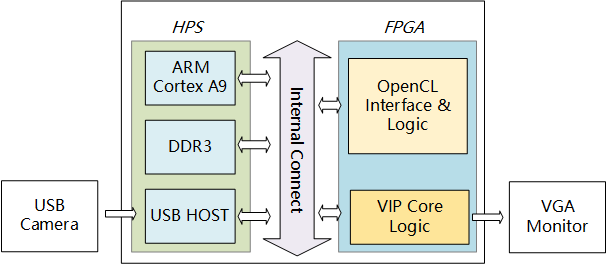

# de1_soc_opencl
## Structure

## Hardware  
**de1soc_sharedonly_vga** is a opencl hardware project that support VGA and desktop for DE1SOC .copy the file to de1soc OpenCL BSP path

	cp -rf de1soc_sharedonly_vga  ~/intelFPGA/16.1/hld/board/terasic/de1soc

modify the board_enc.xml file

	form : hardware dir="." default="de1soc_sharedonly"

	to : hardware dir="." default="de1soc_sharedonly_vga"

## Host APP
### colorGaryAPP
A UVC usb camera application that converting YUYV to RGB and Gray by using opencl.

### sobel_filter_arm32

do sobel by four mathod : arm , neon , opencl ,opencl with shared memory 

| Mathod               | Frequency |  Time     |
| :--------            |:---------:|:---------:|
| Cortex-A9            |900Mhz     | 168ms     |
| Neon                 | ?         | 37ms      |
| OpenCl Shared Memory | 130Mhz    | 14.9ms    |
## Linux kernel

	git clone https://github.com/thinkoco/linux-socfpga.git
	cd linux-socfpga
	git checkout -b de1soc_opencl origin/de1_soc_opencl
	cd de1soc_opencl
	cp Linux-Config .config
	make zImage
	make socfpga_cyclone5_de1soc.dtb

## SD card Image file 

You can use the SD card [Image file](http://pan.baidu.com/s/1ge6wJhp) directly without build kernel and OpenCL 16.1 enviroment.

## MSEL

MSEL:[4:0] ——> 00010， SW10[4:0] on,on,on,off,on

## Limit
When using desktop, copy your generated top.rbf to fat32 partion and cover opencl.rbf.
opencl.rbf should match the same host app .
