# How to Do

## Environment

- Operating System : Ubuntu 18.04 x64
- Quartus Prime    : Quartus Prime Lite 18.1 (QuartusLiteSetup-18.1.0.625-linux.run  standalone) 
- OpenCL SDK       : Intel FPGA SDK for OpenCL 18.1.0.625 (AOCLSetup-18.1.0.625-linux.run standalone)
- Quartus Path     : /opt/intelFPGA_lite/18.1
- SDcard Image     : c5soc_opencl_lxde_fpga_reconfigurable_20201027.zip
- FPGA Board       : Terasic DE10_Nano Version C
- OpenCL BSP Name  : de10_nano_sharedonly_hdmi
- OpenCL Demo      : Mandelbrot
- MSEL[4:0]        : 01010 -> SW10(**1 to 6**) on,off,on,off,on,N/A


## Tools install
### Windows x64

- Quartus Prime Lite 18.1
- Intel FPGA SDK for OpenCL 18.1
- SoC Embedded Design Suite (EDS)

It's easy to use linux commands (arm-linux-guneabihf-gcc,make) in Soc_EDS_command_shell.bat on windows.

### Linux (Ubuntu 18.04 x64)

- Quartus Prime Lite 18.1
- Intel FPGA SDK for OpenCL 18.1
- arm-linux-gnueabihf-gcc
- arm-linux-gnueabihf-g++
- u-boot-tools

```
sudo chmod 777 /opt
./QuartusLiteSetup-18.1.0.625-linux.run --mode text --installdir /opt/intelFPGA_lite/18.1  --accept_eula 1
./AOCLSetup-18.1.0.625-linux.run --mode text --installdir /opt/intelFPGA_lite/18.1  --accept_eula 1
sudo apt update
sudo apt install minicom u-boot-tools gcc-arm-linux-gnueabihf g++-arm-linux-gnueabihf libncurses5-dev make lsb uml-utilities git
```

## Write  Image to MicroSD card
1. show sdx device
```
ls /dev/sd*
```

2. insert sdcard to PC and show the `sdx` device again, the new device is sdcard

 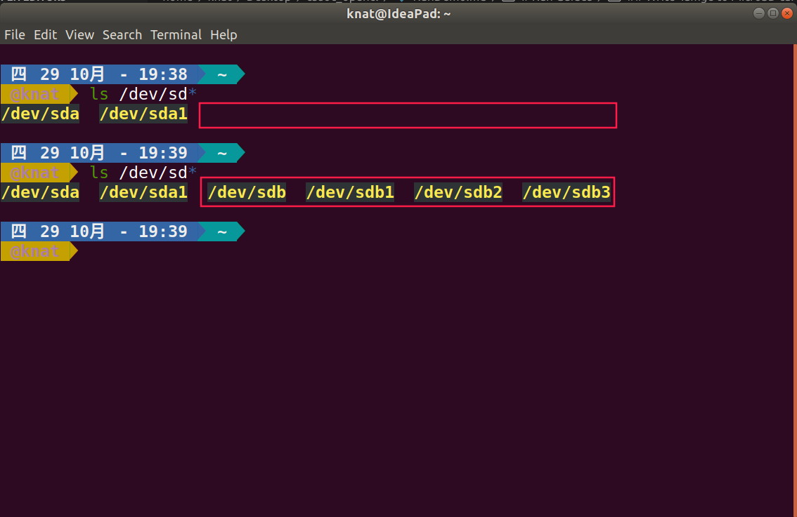

3. unzip the Image and write it to `sdx` with dd (change /dev/sdx to the new device in step 2)

```
unzip c5soc_opencl_lxde_fpga_reconfigurable_20201027.zip
sudo dd if=c5soc_opencl_lxde_fpga_reconfigurable.img of=/dev/sdx status=progress bs=1M
```

 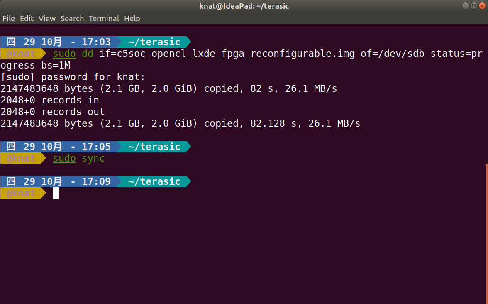

## Compile OpenCL Kernel
1. copy the hardware bsp to `/opt/intelFPGA_lite/18.1/hld/board/c5soc/hardware`

```
git clone https://github.com/thinkococ5soc_opencl.git
cd c5soc_opencl
cp -rf de1soc_sharedonly_vga /optintelFPGA_lite/18.0/hld/board/c5soc/hardware
cp -rf de10_nano_sharedonly_hdmi /opt/intelFPGA_lite/18.0/hld/board/c5soc/hardware
cp -rf de10_standard_sharedonly_vga /opt/intelFPGA_lite/18.0/hld/board/c5soc/hardware
```

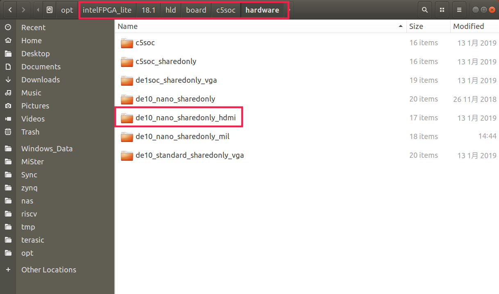

2. source environment and check bsp

About  environment，write the following to env.sh file and change the paths for your situation. Source it using "**source env.sh**" before compiling .aocx and .rbf.
```
export INTELFPGAOCLSDKROOT="/optintelFPGA_lite/18.0/hld"
export QSYS_ROOTDIR="/optintelFPGA_lite/18.0/quartussopc_builder/bin"
export QUARTUS_ROOTDIR_OVERRIDE="/optintelFPGA_lite/18.0/quartus"
export PATH="$PATH:{QUARTUS_ROOTDIR_OVERRIDE}/bin:{QUARTUS_ROOTDIR_OVERRIDE}/linux64:{INTELFPGAOCLSDKROOT}/linux64/bin:{INTELFPGAOCLSDKROOT}/bin:{QSYS_ROOTDIR}"
export LD_LIBRARY_PATH="{INTELFPGAOCLSDKROOT}/host/linux64lib:${AOCL_BOARD_PAKAGE_ROOT}/linux64lib:${LD_LIBRARY_PATH}"
export AOCL_BOARD_PACKAGE_ROOT="{INTELFPGAOCLSDKROOT}/board/c5soc"
export QUARTUS_64BIT=1
```

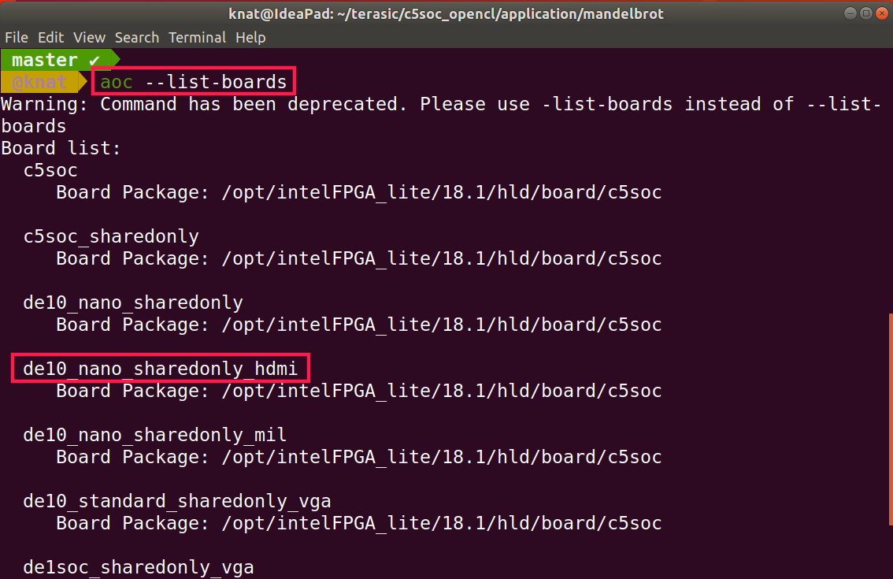

3. compile the Mandelbrot kernel on PC

```
cd c5soc_opencl/application/mandelbrot
aoc device/mandelbrot_kernel.cl -o bin/mandelbrot_kernel.aocx  -board=de10_nano_sharedonly_hdmi -v -report 
```


	aoc device/grayKernel.cl -o bin/grayKernel.aocx -board=de10_nano_sharedonly_hdmi -v -report
	aoc device/sobel.cl -o bin/sobel.aocx -board=de10_nano_sharedonly_hdmi -v -report
	aoc device/mandelbrot_kernel.cl -o bin/mandelbrot_kernel.aocx  -board=de10_nano_sharedonly_hdmi -v -report 
	aoc device/camera_sobel.cl -o bin/camera_sobel.aocx -board=de10_nano_sharedonly_hdmi -v -report


4. compile ok

```
ls bin/mandelbrot_kernel/top.rbf
ls bin/mandelbrot_kernel.aocx 
```


## Update the MicroSD card

1. delete the opencl.rbf and socfpga.dtb in the sdcard

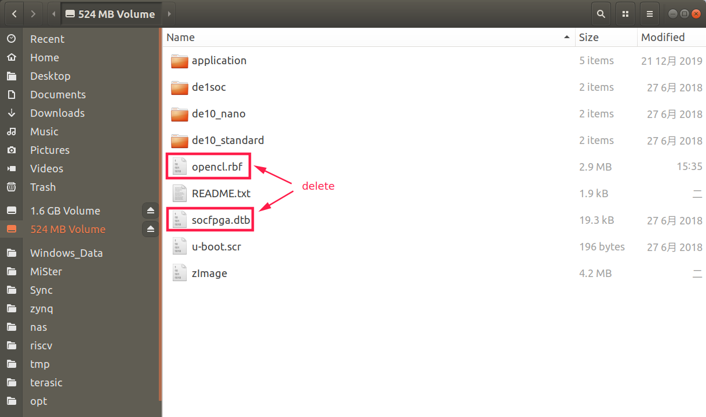

2. copy the de10_nano_socfpga.dtb to sdcard and rename

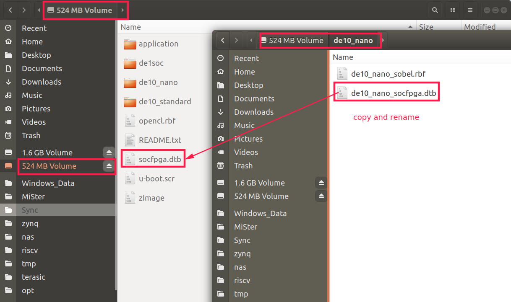

3. copy the top.rbf to sdcard and rename


4. make a foldor `mandelbrot_run` in sdcard and copy  `mandelbrot_kernel.aocx` to it

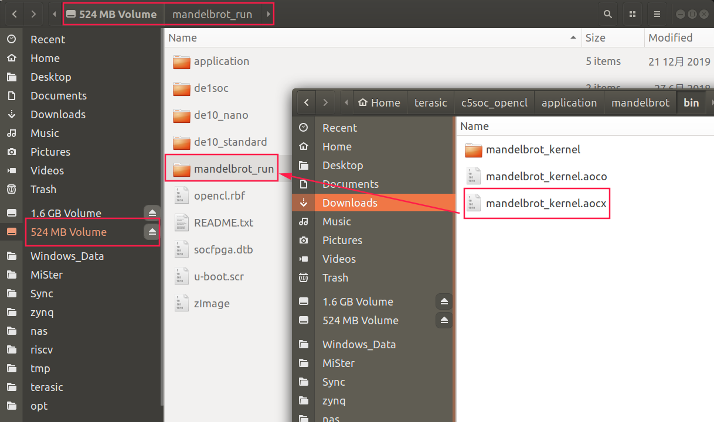

## Build the mandelbrot host on DE10_NANO
1. boot the de10_nano and connect serial port (USB-UART) to PC

```
sudo minicom -D /dev/ttyUSB0 -8 -b 115200
```

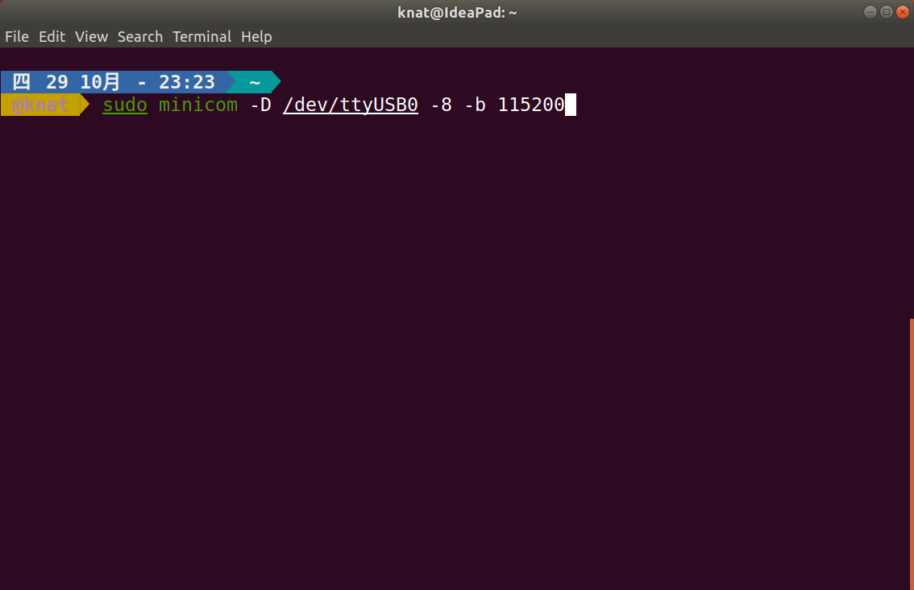

2. login with user:passward(root:root)

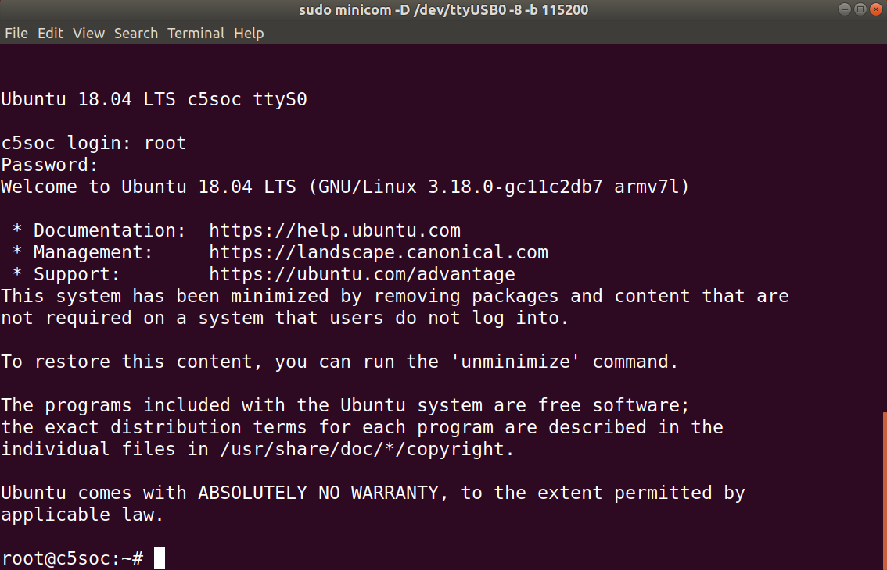

3. source the env on de10_nano and build the mandelbrot host

```
cd /root
source init_opencl_18.1.sh
cd /mnt/application/mandelbrot
make host
```
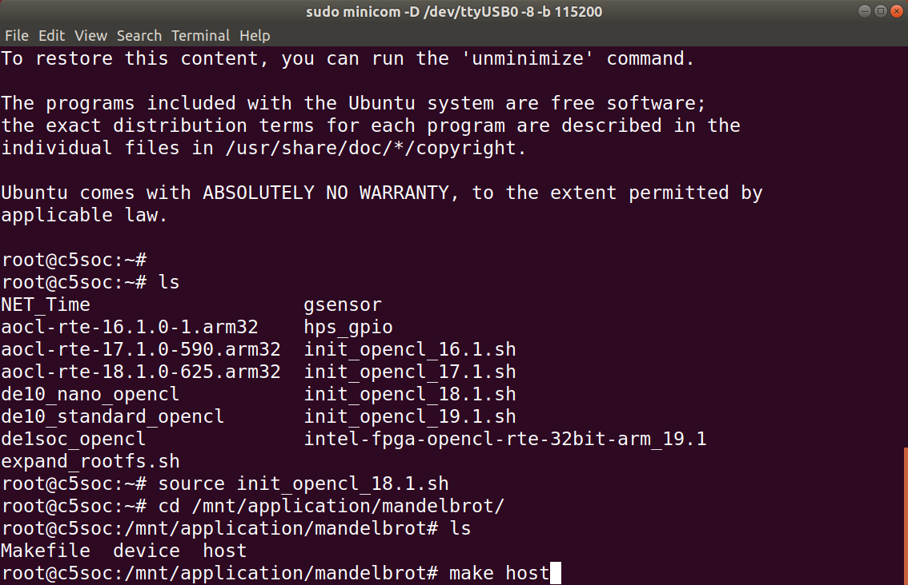

4. copy the host to work dir

```
cp bin/mandelbrot /mnt/mandelbrot_run
```
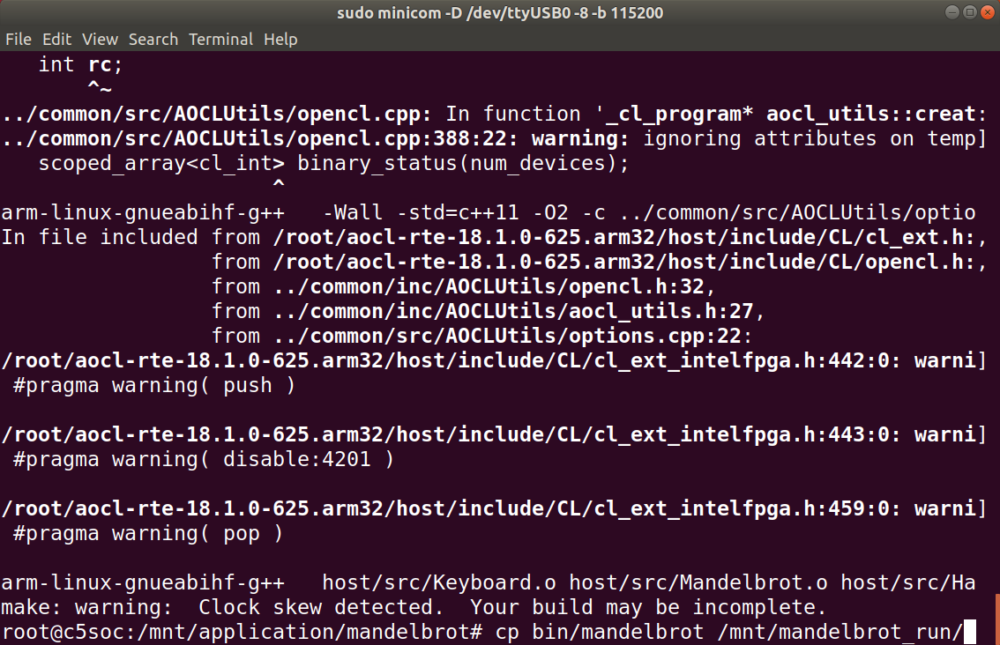


## run mandelbrot on desktop environment

1. login on desktop environment with (knat:knat)

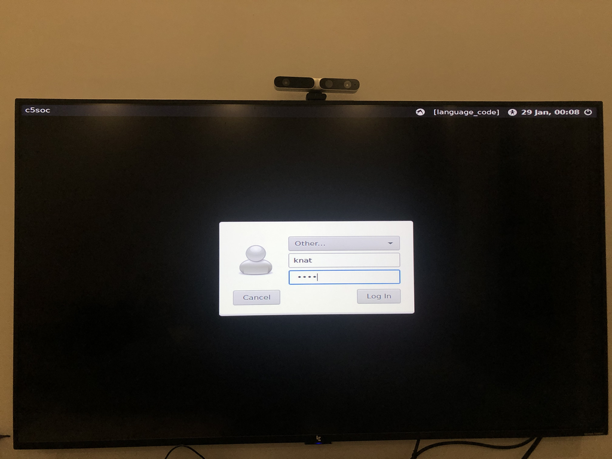

2. open LXterminal

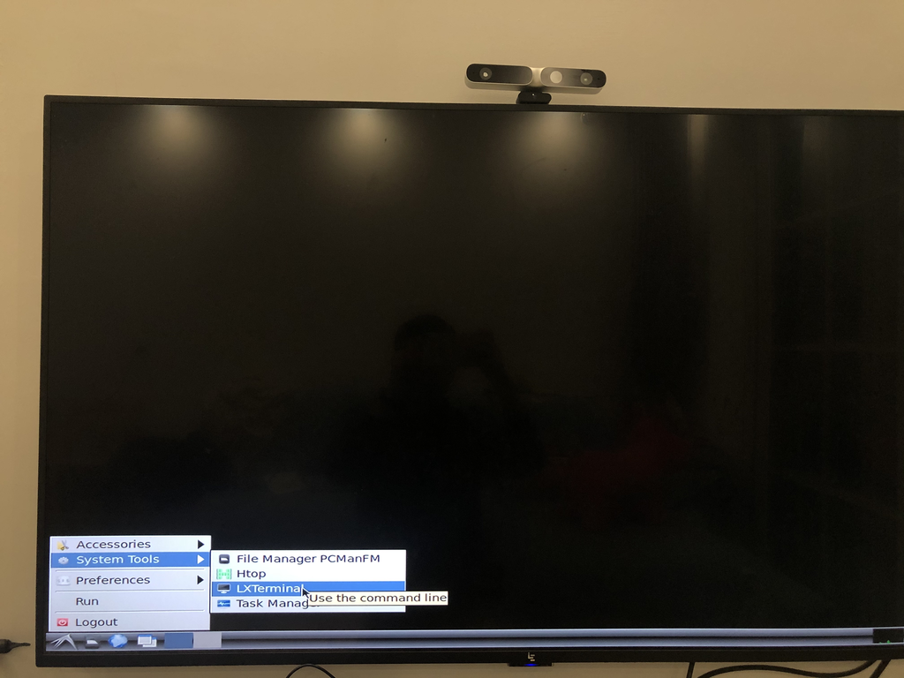

3. source the intel fpga opencl sdk env
```
cd /root
source init_opencl_18.1.sh
```


4. run mandelbrot
```
cd /mnt/mandelbrot_run
./mandelbrot -w=800 -h=640 -c=32
```

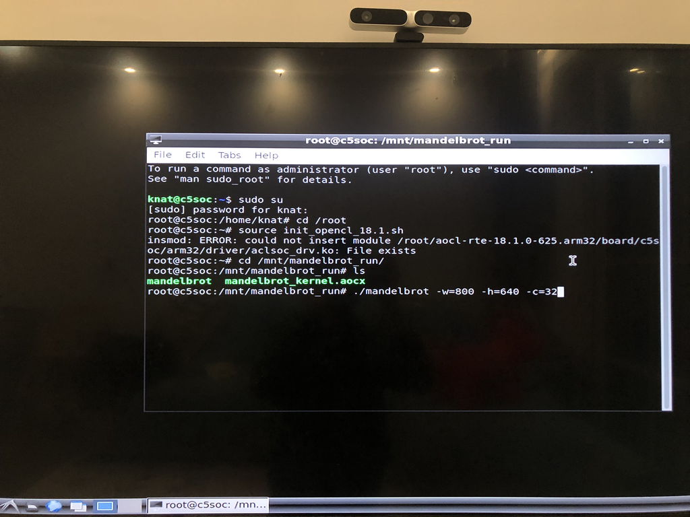

5. the result

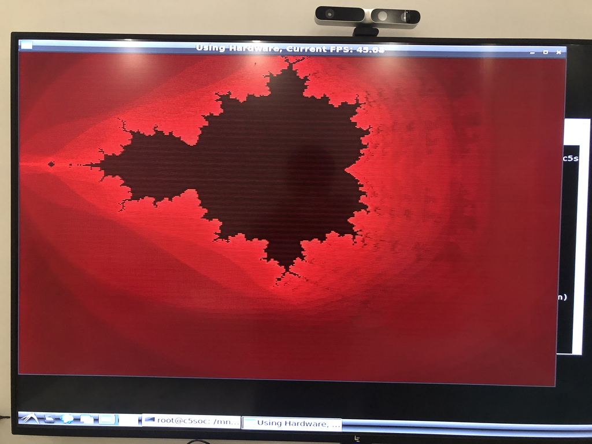


## run demo by aocl program

1. connect  UVC usb camera and USB-UART to DE10_NANO.then,open the uart terminal on PC
   
```
sudo minicom -D /dev/ttyUSB0 -8 -b 115200
```

2. stop lightdm and program by `aocl program`(USB-UART terminal)

```
cd /root
source init_opencl_18.1.sh

cd /mnt/camera_sobel_run

service lightdm stop

rmmod -f altvipfb
rmmod cfbfillrect
rmmod cfbimgblt
rmmod cfbcopyarea

aocl program /dev/acl0 camera_sobel.aocx
 
modprobe altvipfb
service lightdm start
export DISPLAY=:0
```

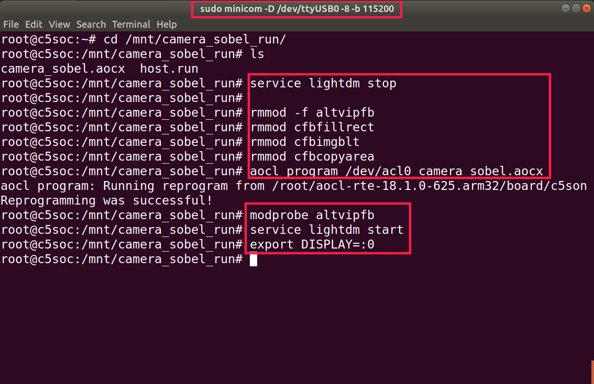

3. login again


4. open LXterminal

 

5. source the intel fpga opencl sdk env and run camera_sobel

```
cd /root
source init_opencl_18.1.sh
cd /mnt/camera_sobel_run
./camera_sobel -v
```

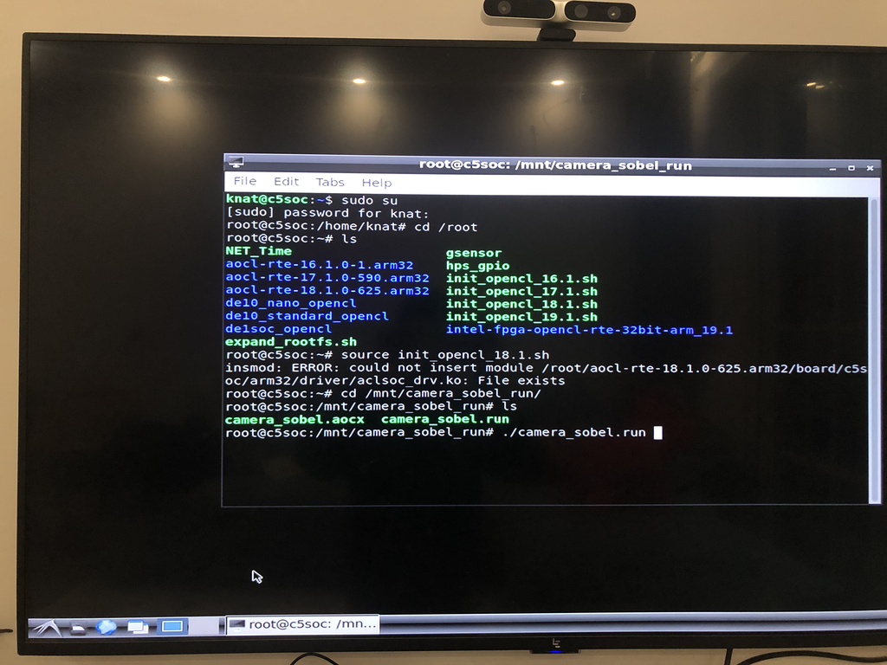

6. the result

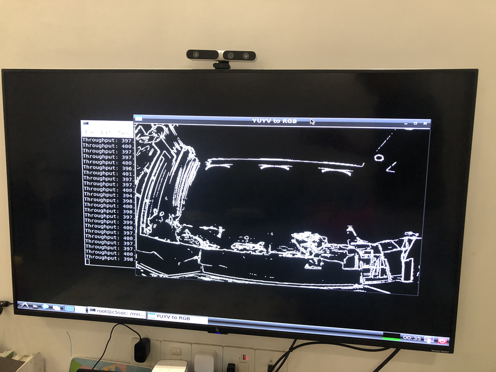