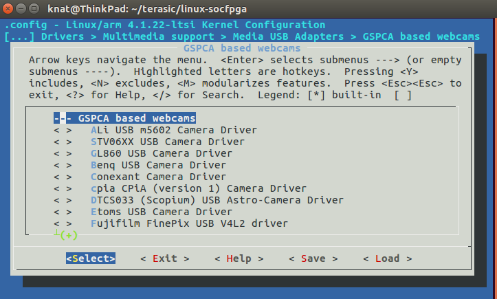

# Linux and Driver
## Linux kernel and Driver
If you want to add more kernel features,you can build your own kernel image.When updating kernel,you should recompile the opencl driver and update to SD card.
*for windows, complie kernel image in Soc_EDS_coomand_shell.bat*

	git clone -b socfpga-opencl_3.18 --depth=10 https://github.com/thinkoco/linux-socfpga.git
	cd linux-socfpga
	cp config_opencl .config
	
	export ARCH=arm
	export CROSS_COMPILE=arm-linux-gnueabihf-
	export LOADADDR=0x8000

	make zImage
	make socfpga_cyclone5_de1soc.dtb
	make socfpga_cyclone5_de10_nano.dtb
	make socfpga_cyclone5_de10_standard.dtb

for x2go only mode.If you just need x2go only, you should remove the video ip core description in the dts files.

	make socfpga_cyclone5_de1soc_x2go.dtb
	make socfpga_cyclone5_de10_nano_x2go.dtb
	make socfpga_cyclone5_de10_standard_x2go.dtb

Also,you can reduce the VIP driver in kernel and rebuild OpenCL driver(This is an optional step).For rebuliding aoc_drv.ko diver,cd to the dirver folder:

	make KDIR=../(to the linux-socfpga kernel path)

## USB Cameras Driver

- UVC (USB video device class) USB Cameras,for example Logitech C270

	Device Drivers > Multimedia support > Media USB Adapters
	


- USB Cameras supported by gspca driver

	Drivers > Multimedia support > Media USB Adapters > GSPCA based webcams
	


## MSEL
- compression rbf (default generated top.rbf)

	quartus_cpf -c -o bitstream_compression=on top.sof opencl.rbf

	MSEL[4:0] ——> 01010， SW10(**1 to 6**) on,off,on,off,on,N/A

- no compression rbf

	quartus_cpf -c top.sof opencl.rbf

	MSEL[4:0] ——> 01000， SW10(**1 to 6**) on,on,on,off,on,N/A


## How to get rbf  form aocx file

If you lost the rbf file and do not want recompile hardware,you can get it from the aocx file.

	aocl binedit boardtest.aocx list
	aocl binedit boardtest.aocx get .acl.fpga.bin fpga.bin
	aocl binedit fpga.bin get .acl.rbf opencl.rbf


## How to update OpenCL Driver
Once updating the zImage,you should rebuild the OpenCL driver and update it to SD card.

- Firstly,get the `Intel FPGA Runtime Environment for OpenCL Linux Cyclone V SoC TGZ` on [Altera Download Website](https://fpgasoftware.intel.com).

- Secondly,make zImage

```
git clone -b socfpga-opencl_3.18 --depth=10 https://github.com/thinkoco/linux-socfpga.git
cd linux-socfpga
cp config_opencl .config
export ARCH=arm
export CROSS_COMPILE=arm-linux-gnueabihf-
export LOADADDR=0x8000

make zImage
make modules
```

- Thirdly,indicate the KDIR when compiling the OpenCL driver.

```
cd PATHto/aocl-rte-16.1.0-1.arm32/board/c5soc/driver
cd PATHto/aocl-rte-17.1.0-590.arm32/board/c5soc/arm32/driver
make KDIR=PATHto/linux-socfpga
```
in my case,
```
cd ~/terasic/aocl-rte-17.1.0-590.arm32/board/c5soc/arm32/driver
make KDIR=~/terasic/linux-socfpga
```

- Finally,update the zImage and aclsoc\_drv.ko to sd card.Also,you may need to update the insmod path in `init_opencl_17.1.sh`,such as `insmod /root/aclsoc_drv/17.1/aclsoc_drv.ko`
